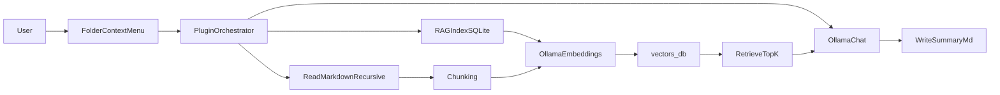

# Obsidian Summarizer — Spezifikation (MVP)

| Feld | Wert |
|------|------|
| Version | 0.1 |
| Kontext | FFHS, Modul «Generative KI für Softwareentwickler», BSc Informatik |
| Stand | 9. Mai 2026 |

Dieses Dokument fasst ADR, PRD, MVP-Scope und technische Architektur zu **einer implementierungsnahen Referenz** zusammen. Abweichungen von der Seminararbeit sind bewusst geklärt (Modell-Tags, Quellenfilter).

---

## 1. Zweck und Scope (MVP)

**Zweck:** Obsidian-Nutzerinnen und -Nutzer erzeugen aus bestehenden Markdown-Notizen in einem **gewählten Vault-Ordner** (inklusive Unterordner) per UI-Aktion eine **lokale, strukturierte Zusammenfassung**. Ausgabe ist eine **ordnerspezifische** Markdown-Datei im **selben Ordner** wie die Kontextaktion (Muster siehe US-03), nicht ein global gleicher Dateiname in jedem Ordner.

**Explizit ausserhalb des MVP:** Cloud-LLMs und externe APIs für Vault-Inhalte, Benutzerkonten, Mehrbenutzerfunktionen, Obsidian-Community-Store-Produktionsreife, Cloud-Sync als Produktfeature.

---

## 2. User Stories

### US-01 — Ordnerkontext

Als Obsidian-Nutzerin möchte ich **alle Markdown-Dateien unter einem Ordner** (rekursiv) über einen **Kontextmenüeintrag am Ordner** zusammenfassen, damit ich nicht jede Datei einzeln lesen muss.

- UI: Kontextmenü auf **Ordner**, Eintrag **Create Summary** (Anzeigename; interner Command-Identifier kann abweichen, z. B. `create-summary`).
- Umfang: alle Dateien mit Endung `.md` unter dem gewählten Pfad, **inkl. Unterordner**.

### US-02 — Qualität der Zusammenfassung

Als Nutzerin möchte ich eine **kurze, prägnante** Zusammenfassung, die sich **inhaltlich an die bereitgestellten Quelltexte hält** (Retrieval-Augmented Generation, kein «freies Raten» ohne Kontext).

### US-03 — Persistenz im Vault

Als Nutzerin möchte ich die Ausgabe **als normale Obsidian-Notiz** im Vault, im **ausgewählten Ordner**, mit einem **eindeutigen, ordnerbezogenen Dateinamen**, damit Obsidian viele gleichnamige Dateien in verschiedenen Ordnern nicht verwechselt (Suche, Graph, Backlinks).

**Dateinamen-Muster (verbindlich):**

| Fall | Dateiname im Zielordner |
|------|-------------------------|
| Standard (erste Summary / Überschreiben) | `{Ordnername}_summary.md` |
| Neue Version (optional, ohne Überschreiben) | `{Ordnername}_summary_2.md`, `{Ordnername}_summary_3.md`, … |

- **`{Ordnername}`:** letztes Segment des gewählten Ordnerpfads, für Vault-Dateinamen **sanitisiert** (keine Pfadtrenner, keine Zeichen `\ / : * ? " < > |`, Leerzeichen → `_`, aufeinanderfolgende `_` zusammengezogen; leerer Rest → `folder`).
- **Standardverhalten:** wiederholte Ausführung für denselben Ordner **überschreibt** `{Ordnername}_summary.md`.
- **Neue Version:** optional nächste freie Nummer ≥ 2 (`_summary_2`, `_summary_3`, …), wenn das Produkt Überschreiben vermeiden soll (konkrete UX: Implementierung, z. B. Notice oder Einstellung).

---

## 3. Nicht-funktionale Anforderungen (verbindlich)

| ID | Anforderung | Umsetzungshinweis |
|----|--------------|------------------|
| PRD-NF01 | Datenschutz: Inhalte bleiben lokal | Kein Versand von Vault-Text an Drittanbieter-LLM-APIs. |
| PRD-NF02 | Sicherheit: keine externe Übertragung von Vault-Inhalten für KI | Nur `127.0.0.1`/konfigurierbare lokale Ollama-Instanz. |
| PRD-NF03 | Keine laufenden API-Kosten | Kein Cloud-Token-Modell im MVP. |

**Zusätzlich:** Plugin greift nur auf Vault-Pfade zu, die Obsidian ohnehin freigibt; **kein** Löschen von Nutzerdateien ausserhalb der definierten Schreibaktion auf Summary-Ausgabedateien (Muster US-03). Nutzerhinweis bei Überschreiben von `{Ordnername}_summary.md` ist wünschenswert (konkrete UX: Implementierung).

---

## 4. Architektur

### 4.1 Komponenten

| Bereich | Technologie | Rolle |
|---------|-------------|--------|
| UI | Obsidian Desktop Plugin API | Ordner-Kontextmenü **Create Summary**, Einstellungsseite |
| Logik | TypeScript / JavaScript | Orchestrierung, Chunking, Promptbau, IO |
| Build | Node.js 20+, npm | Build und Paketierung des Plugins |
| LLM + Embeddings | Ollama (lokal, Default `http://127.0.0.1:11434`) | Chat/Generate + Embedding-API |
| Generierung (Default) | `gemma4:e2b` | Leichteres Standardmodell |
| Generierung (optional) | `gemma4:e4b` | Qualitäts-Modell, in Einstellungen wählbar |
| Embeddings | `nomic-embed-text` | Vektoren für Chunks |
| Vektorindex | SQLite + `sqlite-wasm-vec` | Semantische Suche über Chunks |
| Index-Datei | `vectors.db` | Liegt im **Plugin-Datenverzeichnis** (nicht im Nutzer-Vault), sofern nicht anders entschieden |

**Hinweis Modell-Tags:** Im Projektbericht genannte Tags `gemma4:e2b` und `gemma4:e4b` sind auf der Referenz-Umgebung per `ollama list` verifiziert. Öffentliche Ollama-Library kann parallel andere Familien (z. B. `gemma3`) führen; **kanonisch für dieses Repo** bleiben die obigen Strings, bis das Team sie ändert.

### 4.2 Datenfluss

### 4.3 Vault-Events und Index

- Beim **Start von Obsidian:** Initialer Aufbau oder Fortschreiben des lokalen Vektorindex (Policy: ganzer Vault vs. «lazy per Ordner» — MVP-Minimum: Index muss für **Retrieve zum Zeitpunkt von Create Summary** konsistent sein; empfohlen: Event-getriebene Updates für `.md`-Änderungen).
- **Obsidian Event Bus:** Auf Änderungen an Markdown-Dateien reagieren (neu, geändert, gelöscht) und Embeddings/DB entsprechend pflegen.

### 4.4 Quellenfilter (Pflicht)

Um **Feedback-Schleifen** und Müll im Index zu vermeiden:

1. **Plugin-Summary-Ausgaben niemals als Quelle** für Chunking, Embedding oder Retrieval (Feedback-Schleifen vermeiden). Konkret: Dateinamen, die dem Muster `*_summary.md` oder `*_summary_<Zahl>.md` entsprechen (`<Zahl>` ≥ 2), werden beim Einlesen des Korpus **übersprungen**. Legacy-Dateien namens `summary.md` werden ebenfalls ausgeschlossen, falls sie im Vault noch existieren.
2. Optional aber empfohlen: Ordner **`.obsidian`** und andere Plugin-/Cache-Pfade aus dem rekursiven Scan **ausschliessen**.

Diese Regeln sind Teil der Akzeptanz des MVP.

---

## 5. Ollama-Schnittstelle

- **Base URL (Default):** `http://127.0.0.1:11434`
- **Chat/Generate:** REST-API von Ollama gemäss aktueller Dokumentation (`/api/generate` oder Chat-Endpoint, je nach gewählter Implementierung).
- **Embeddings:** passender Embedding-Endpoint für das konfigurierte Embedding-Modell (z. B. `nomic-embed-text`).
- **Fehlerverhalten:** Bei nicht erreichbarer Instanz, fehlendem Modell oder Timeout **sichtbare Obsidian-Notice** (kein stiller Fehler).

---

## 6. Einstellungen (Minimum)

Konfigurierbar über Plugin-Einstellungen:

| Schlüsselidee | Beschreibung |
|---------------|--------------|
| Ollama Base URL | String, Default siehe oben |
| Modell Generierung | Default `gemma4:e2b`, optional Umschalten auf `gemma4:e4b` |
| Modell Embeddings | Default `nomic-embed-text` |
| Chunking (optional MVP+) | Chunk-Grösse und Overlap, falls nicht fest im Code |

---

## 7. Prompting (Ziele, kein fixer Text)

Der finale System- und User-Prompt wird iterativ festgelegt («Try and Error» laut Projektbericht). **Ziele, die die Implementierung erfüllen muss:**

- Ausgabe ist **valides Markdown**, Obsidian-konform (u. a. Inline- und Block-Math mit `$` / `$$` nicht kaputtformatieren).
- Inhalt soll **Retrieval-Kontext** nutzen; bei Evaluations-Testfällen sollen **explizit in den Quellen eingebaute Fehler** in der Summary wiedererkennbar sein (Nachweis: Modell nutzt Quelle, nicht nur Allgemeinwissen).
- Orthographie: bei deutschsprachigen Zusammenfassungen **Schweizer Konvention** (ss, Umlaute) wenn der Nutzer deutschsprachige Quellen zusammenfasst; genaue Sprache der Ausgabe kann über Prompt oder Locale-Regel festgelegt werden.

---

## 8. Akzeptanzkriterien und Evaluation

| Metrik | Ziel | Messung |
|--------|------|---------|
| Generierungszeit | unter 80 Sekunden | Start bei Auswahl **Create Summary** bis fertig geschriebene Summary-Ausgabedatei (US-03) auf Referenzrechner (Projekt: MacBook M4 Pro, geringe Systemlast). |
| Inhaltsabdeckung | ca. 80 % Schlüsselpunkte; speziell: eingebaute **Fehler in Quellen** tauchen in der Summary auf | Drei künstliche lange Markdown-Dateien mit eingestreuten Fehlern; manuell oder checklistenbasiert prüfen. |
| Format | Valides Markdown | Automatisiert oder manuell; Link-Syntax und Math spot-check. |

---

## 9. Tech-Stack-Checkliste

- [ ] Obsidian Desktop Plugin API
- [ ] TypeScript, Build mit Node 20+
- [ ] Ollama lokal
- [ ] Modelle: `gemma4:e2b`, optional `gemma4:e4b`, Embeddings `nomic-embed-text`
- [ ] SQLite + `sqlite-wasm-vec` für Vektorindex
- [ ] Persistenz `vectors.db` unter Plugin-Datenpfad
- [ ] Ein- und Ausgabe: Markdown (`.md` → `{Ordnername}_summary.md` bzw. versioniert)

---

## 10. Risiken und Abhängigkeiten (kurz)

- **Hardware:** lokale Latenz und RAM bestimmen Nutzbarkeit von `gemma4:e4b`.
- **Modellverfügbarkeit:** bei Wegfall der Tags Alternativen evaluieren (kein Pflicht-Pre-Research im MVP).
- **Obsidian-API:** Änderungen zwischen Obsidian-Versionen können Anpassungen erfordern.

---

## 11. Implementierungsreihenfolge (Auszug Roadmap)

1. Projekt- und Plugin-Setup (Boilerplate, Manifest).
2. Ollama-Anbindung: Healthcheck, Generate, Schreiben einer Testdatei ins Vault.
3. RAG: Chunking, Embeddings, SQLite-Vektorstore, Vault-Events.
4. Verknüpfung Retrieve → Prompt → Generate → Summary-Ausgabedatei (US-03).
5. Einstellungen UI.
6. Review, Tests laut Kapitel 8, kurze Architektur-Doku im Repo.

---

## 12. Glossar

| Begriff | Bedeutung |
|---------|-----------|
| RAG | Retrieval-Augmented Generation: relevante Chunks werden gesucht und dem Generator mitgegeben |
| Chunk | kleiner Textabschnitt aus Markdown für Embedding und Suche |
