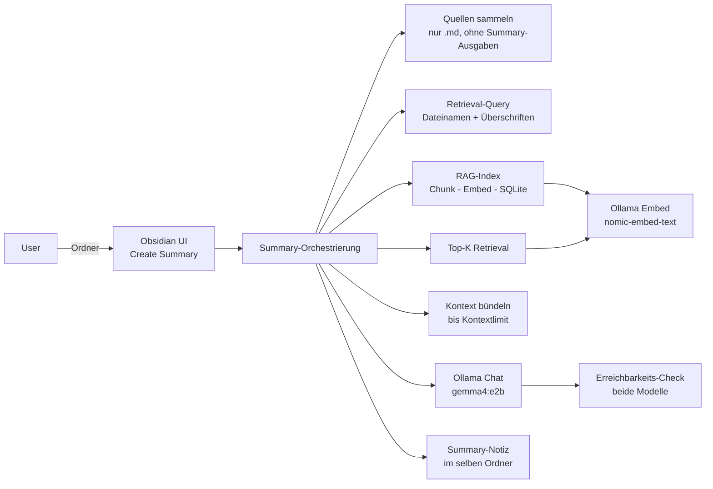

# Systemarchitektur — Obsidian Summarizer (MVP)

Konzepte, Datenflüsse und Verantwortlichkeiten. Produktspezifikation: [SPEC.md](../SPEC.md). Modul-Themen: [docs/modules/README.md](modules/README.md). Ethik: [docs/ethik.md](ethik.md).

---

## Gesamtidee

Obsidian-Plugin, das aus Markdown-Notizen in einem **gewählten Ordner** eine **lokale Zusammenfassung** erzeugt. Kein Cloud-LLM: Ollama auf `127.0.0.1`, Vektorindex im Plugin-Datenverzeichnis.

**Kernprinzip:** Vault-Inhalte werden gechunked, embedded und semantisch durchsucht (RAG). Nur relevante Textabschnitte landen im Prompt — nicht der ganze Ordner.

---

## Datenfluss — Create Summary

---

## Schichten (logisch)

| Schicht | Aufgabe | Detail |
|---------|---------|--------|
| **UI & Einstellungen** | Menü, Settings, Notices | Obsidian-Integration; drei Einstellungsbereiche Ollama / Vektorindex / Zusammenfassung |
| **Summary-Orchestrierung** | Ein Lauf von Klick bis `{Ordner}_summary.md` | Koordiniert Quellen, RAG, LLM, Schreiben; bricht bei Fehler mit Notice ab |
| **RAG** | Vektorindex + Retrieval | Hintergrund-Index bei Vault-Änderungen; on-demand vor jedem Lauf |
| **Ollama-Anbindung** | Zwei Rollen: **Generierung** und **Embeddings** | Beide Modelle müssen vor Lauf erreichbar sein |
| **Quellenpolicy** | Was indexiert und gelesen wird | Keine `.obsidian/`, keine Plugin-Summary-Dateien als Quelle |

Quellcode liegt unter `src/` — Dateizuordnung bewusst nicht Teil dieser Architektur-Doku; siehe [docs/modules/](modules/README.md) nur für fachliche Vertiefung.

---

## Index-Policy (RAG)

Drei Auslöser, absteigende Priorität:

| Auslöser | Wann | Wirkung |
|----------|------|---------|
| **Vault-Event** | Datei geändert oder neu | Sofort indexieren; Idle-Planung abbrechen |
| **On-demand** | Create Summary gestartet | Ordner synchron indexieren, dann Retrieval |
| **Idle** | Plugin-Start, Restqueue | Hintergrund, kleine Batches |

Gelöschte Dateien verschwinden aus Index und Idle-Queue. Ausgeschlossene Pfade: [docs/modules/sources.md](modules/sources.md).

Speicherort Vektorindex: `vectors.db` im Plugin-Datenverzeichnis — **nicht** im Vault.

---

## Summary-Lauf (Ablauf)

| Schritt | Was passiert |
|---------|----------------|
| 1 | Markdown-Quellen im Ordner (rekursiv) ermitteln; leerer Ordner → Abbruch mit Notice |
| 2 | Retrieval-Query aus Metadaten der Quellen (Dateinamen, erste Überschriften) |
| 3 | Betroffenen Ordnerbaum in den Vektorindex einpflegen |
| 4 | Semantisch passende Top-K-Textchunks laden |
| 5 | Chunks zu einem Kontextstring zusammenfügen; Überschreitung Kontextlimit → Abbruch |
| 6 | Ollama-Erreichbarkeit und beide Modelle prüfen |
| 7 | Strukturierte Summary per Chat erzeugen (System-Prompt + Kontext) |
| 8 | Markdown-Ausgabe schreiben — Basisdatei oder nummerierte Version, optional Überschreiben |

Jeder Fehlschlag → sichtbare Notice (SPEC §5). Limitationen Inhalt/Bias: [docs/ethik.md](ethik.md).

---

## Einstellungen (Konzept)

| Bereich | Steuert |
|---------|---------|
| **Ollama** | URL, Generierungsmodell, Embedding-Modell, Timeout, Verbindungstest |
| **Vektorindex** | Kontextlimit, Chunk-Grösse, Overlap, Top-K, Index zurücksetzen |
| **Zusammenfassung** | Ob `{Ordner}_summary.md` bei erneutem Lauf überschrieben wird |

Vollständige Felder: [SPEC.md §6](../SPEC.md#6-einstellungen-minimum).

---

## Rolle der KI

| Ebene | Rolle |
|-------|--------|
| **Runtime** | Ollama: Embeddings (`nomic-embed-text`) und Summary-Text (`gemma4:e2b`) — kein Cloud-LLM |
| **Plugin** | Orchestrierung, Index, Prompt, Datei schreiben; LLM liefert nur Summary-Inhalt |
| **Entwicklung** | KI-Agenten (Cursor u. a.) unter Spec, Skills, Review — siehe [docs/ki-zusammenarbeit.md](ki-zusammenarbeit.md) |

Design-Entscheide: [docs/adr/](adr/).
