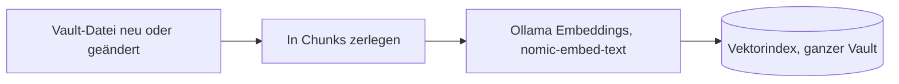
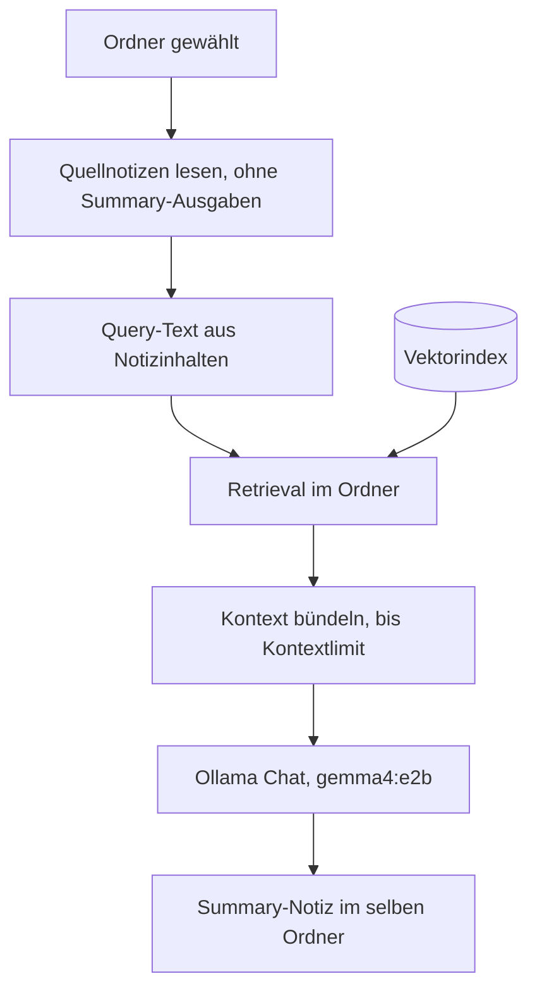

# Systemarchitektur — Obsidian Summarizer (MVP)

Konzepte, Datenflüsse und Verantwortlichkeiten. Produktspezifikation: [SPEC.md](../SPEC.md). Modul-Themen: [docs/modules/README.md](modules/README.md). Ethik: [docs/ethik.md](ethik.md).

---

## Gesamtidee

Obsidian-Plugin, das aus Markdown-Notizen in einem **gewählten Ordner** eine **lokale Zusammenfassung** erzeugt. Kein Cloud-LLM: Ollama auf `127.0.0.1`, Vektorindex im Plugin-Datenverzeichnis.

**Kernprinzip:** Vault-Inhalte werden in Chunks zerlegt, als Vektoren gespeichert und semantisch durchsucht (RAG). Nur relevante Textabschnitte landen im Prompt, nicht der ganze Ordner.

---

## Zwei Abläufe, ein Index

Indexierung und Create Summary laufen getrennt und teilen sich denselben Vektorindex. Die Indexierung hält im Hintergrund den ganzen Vault aktuell. Create Summary nutzt auf Klick nur den gewählten Ordner.

### Indexierung (Hintergrund, ganzer Vault)

### Create Summary (auf Klick, nur der Ordner)

---

## Schichten (logisch)

| Schicht | Aufgabe | Detail |
|---------|---------|--------|
| **UI & Einstellungen** | Menü, Settings, Notices | Obsidian-Integration; drei Einstellungsbereiche Ollama / Vektorindex / Zusammenfassung |
| **Summary-Orchestrierung** | Ein Lauf von Klick bis `{Ordner}_summary.md` | Koordiniert Quellen, RAG, LLM, Schreiben; bricht bei Fehler mit Notice ab |
| **RAG** | Vektorindex und Retrieval | Hintergrund-Index bei Vault-Änderungen; on-demand vor jedem Lauf |
| **Ollama-Anbindung** | Zwei Rollen: Generierung und Embeddings | Beide Modelle müssen vor dem Lauf erreichbar sein |
| **Quellenpolicy** | Was indexiert und gelesen wird | Keine `.obsidian/`, keine Plugin-Summary-Dateien als Quelle |

Fachliche Vertiefung pro Modul: [docs/modules/](modules/README.md).

---

## Index-Policy (RAG)

Drei Auslöser, absteigende Priorität:

| Auslöser | Wann | Wirkung |
|----------|------|---------|
| **Vault-Event** | Datei geändert oder neu | Sofort indexieren; Idle-Planung abbrechen |
| **On-demand** | Create Summary gestartet | Ordner synchron indexieren, dann Retrieval |
| **Idle** | Plugin-Start, Restqueue | Hintergrund, kleine Batches |

Gelöschte Dateien verschwinden aus Index und Idle-Queue. Ausgeschlossene Pfade: [docs/modules/sources.md](modules/sources.md).

**Reichweite:** Der Index erfasst den ganzen Vault. Das Retrieval beschränkt sich auf den gewählten Ordner (Pfad-Präfix). So bleibt eine Summary auf die Inhalte des Ordners bezogen, obwohl der Index breiter ist.

**Speicherort:** `vectors.db` im Plugin-Datenverzeichnis, nicht im Vault.

**Backend:** Verwendet wird das erste verfügbare Backend in der Reihenfolge WASM-SQLite, better-sqlite3, JSON-Datei (Rückfallebene). Damit läuft der Index auch dort, wo native Module fehlen.

---

## Summary-Lauf (Ablauf)

| Schritt | Was passiert |
|---------|----------------|
| 1 | Markdown-Quellen im Ordner (rekursiv) ermitteln; bei leerem Ordner Abbruch mit Notice |
| 2 | Query-Text aus den Inhalten der Quellnotizen bilden (gekürzt auf eine Obergrenze) |
| 3 | Betroffenen Ordnerbaum in den Vektorindex einpflegen |
| 4 | Semantisch passende Top-K-Chunks laden, beschränkt auf den Ordner |
| 5 | Chunks zu einem Kontextstring zusammenfügen; bei Überschreitung des Kontextlimits Abbruch |
| 6 | Ollama-Erreichbarkeit und beide Modelle prüfen |
| 7 | Strukturierte Summary per Chat erzeugen (System-Prompt und Kontext) |
| 8 | Markdown-Ausgabe schreiben: Basisdatei oder nummerierte Version, optional Überschreiben |

Jeder Fehlschlag führt zu einer sichtbaren Notice (SPEC §5). Grenzen bei Inhalt und Bias: [docs/ethik.md](ethik.md).

---

## Einstellungen (Konzept)

| Bereich | Steuert |
|---------|---------|
| **Ollama** | URL, Generierungsmodell, Embedding-Modell, Timeout, Verbindungstest |
| **Vektorindex** | Kontextlimit, Chunk-Grösse, Overlap, Top-K, Index zurücksetzen |
| **Zusammenfassung** | Ob `{Ordner}_summary.md` bei erneutem Lauf überschrieben wird |

Vollständige Felder: [SPEC.md §6](../SPEC.md#6-einstellungen-minimum).

---

## Rolle der KI

| Ebene | Rolle |
|-------|--------|
| **Runtime** | Ollama: Embeddings (`nomic-embed-text`) und Summary-Text (`gemma4:e2b`); kein Cloud-LLM |
| **Plugin** | Orchestrierung, Index, Prompt, Datei schreiben; das LLM liefert nur den Summary-Inhalt |
| **Entwicklung** | KI-Agenten (Cursor u. a.) unter Spezifikation, Skills und Review: [docs/ki-zusammenarbeit.md](ki-zusammenarbeit.md) |

Design-Entscheide: [docs/adr/](adr/).
