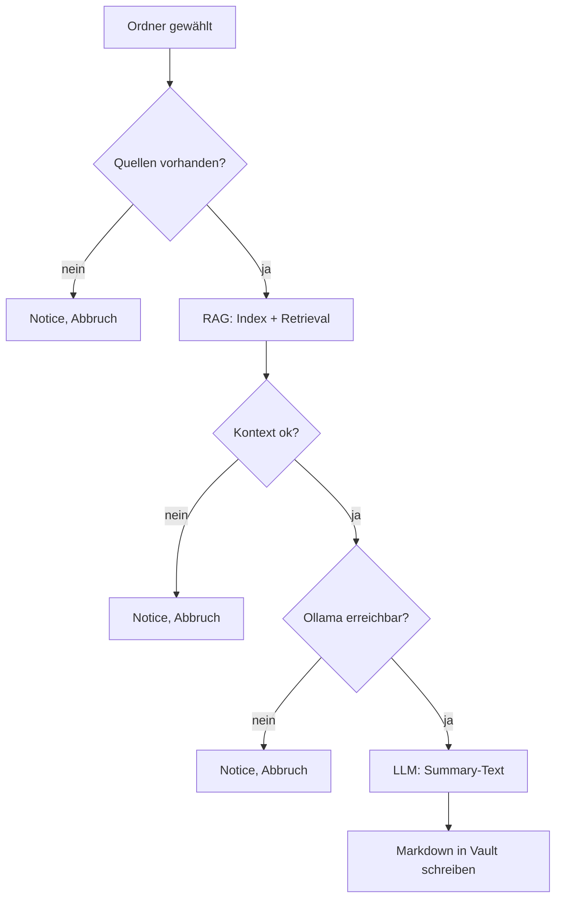

# Create Summary — Ablauf und Ausgabe

Zentrale Produktfunktion (US-01 bis US-03): aus einem Ordner eine **lokale, strukturierte Markdown-Summary** erzeugen.

Spezifikation: [SPEC.md §2](../../SPEC.md#2-user-stories-mvp). Gesamtfluss: [docs/architecture.md](../architecture.md).

---

## Auslöser

**Rechtsklick auf einen Ordner** (nicht auf einzelne Datei) → **Create Summary**.

Erwartung: Notices für Indexierung und Generierung, danach Erfolgs-Notice mit Dateiname.

---

## Ablauf (logisch)

Schritte im Detail: [docs/architecture.md § Summary-Lauf](../architecture.md#summary-lauf-ablauf).

---

## Prompt und Qualität

Das LLM erhält einen **System-Prompt** (Ziele: gültiges Markdown, Schweizer Konvention bei DE-Quellen, Orientierung am Retrieval-Kontext) und einen **User-Prompt** mit Kontext + Ordnerbezug.

Prompt-Ziele und Evaluation: [SPEC.md §7–8](../../SPEC.md#7-prompting-ziele-kein-fixer-text). Inhaltliche Grenzen (Bias, Quelltreue): [docs/ethik.md](../ethik.md).

---

## Ausgabe im Vault (US-03)

| Situation | Ergebnis |
|-----------|----------|
| Erster erfolgreicher Lauf | `{Ordnername}_summary.md` (**Summary-Basisdatei**) |
| Weitere Läufe, Überschreiben **aus** | `{Ordnername}_summary_2.md`, `_summary_3`, … |
| Weitere Läufe, Überschreiben **an** | Basisdatei wird ersetzt |

Summary-Dateien sehen aus wie normale Notizen — kein automatischer KI-Vermerk (siehe Ethik-Doku).

---

## Abhängigkeiten

- [rag.md](./rag.md) — Kontext für das LLM
- [docs/ollama/README.md](../ollama/README.md) — Textgenerierung
- [sources.md](./sources.md) — welche `.md` zählen

---

## Siehe auch

- [docs/modules/README.md](./README.md) — Kurztest
- [docs/ollama/README.md](../ollama/README.md) — Voraussetzungen
