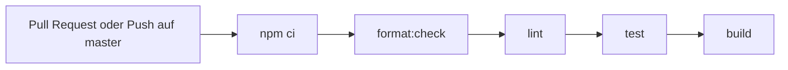

# Qualitätssicherung — CI, Tests und Linting

Wie das Repository Codequalität absichert: automatische Prüfung in der CI, Teststrategie und statische Analyse. Entwickler-Befehle: [README.md § Entwicklung](../README.md#entwicklung).

---

## Continuous Integration

Workflow [`/.github/workflows/ci.yml`](../.github/workflows/ci.yml), ausgelöst bei jedem Pull Request und bei Push auf `master`. Ein einziger Job (`quality`) führt die gleichen Schritte aus, die auch lokal vor einem Pull Request gelten:



Bricht ein Schritt ab, schlägt der gesamte Job fehl. Pull Requests gegen `master` benötigen einen grünen Lauf. Damit beschreibt die CI dieselbe Reihenfolge wie die lokale Prüfung, kein zusätzliches verstecktes Verhalten.

| Schritt | Befehl | Sichert |
|---------|--------|---------|
| Abhängigkeiten | `npm ci` | Reproduzierbare Installation aus `package-lock.json` |
| Format | `npm run format:check` | Einheitliche Formatierung (Prettier) |
| Lint | `npm run lint` | Statische Regeln (ESLint) |
| Tests | `npm test` | Verhalten der öffentlichen Module (Vitest) |
| Build | `npm run build` | Typecheck und Bundle nach `main.js` |

---

## Teststrategie

- **Framework:** Vitest. Testdateien liegen als `src/**/*.test.ts` neben dem geprüften Modul.
- **Nur öffentliche Exporte:** Getestet wird beobachtbares Verhalten, nicht die interne Implementierung. Testnamen beschreiben das Verhalten, nicht den Code.
- **Kein echtes Obsidian:** `vitest.config.ts` bildet das Modul `obsidian` auf den Stub [`src/test-utils/obsidian-stub.ts`](../src/test-utils/obsidian-stub.ts) ab. Weitere Grenzen werden bei Bedarf mit `vi.mock` gemockt; eigene `src/`-Module bleiben ungemockt.
- **Ports statt Seiteneffekte:** Die Orchestrierung (`create-summary-rag-run`) erhält ihre Abhängigkeiten injiziert. Tests laufen dadurch ohne Ollama, ohne Dateisystem und deterministisch.

Einzelne Datei prüfen: `npx vitest run src/settings.test.ts`. Watch-Modus: `npm run test:watch`.

---

## Linting und Formatierung

- **ESLint** (`npm run lint`) prüft die TypeScript-Regeln im gesamten Projekt.
- **Prettier** (`npm run format:check`) prüft die Formatierung; `npm run format` schreibt Korrekturen.
- Der Geltungsbereich von Prettier richtet sich nach [`.prettierignore`](../.prettierignore). Build-Artefakte (`main.js`), `node_modules/` sowie längere Fliesstexte (`docs/`, `SPEC.md`, `README.md`, `src/README.md`) sind ausgenommen; geprüft wird vor allem Quellcode und Konfiguration.

---

## Vor einem Pull Request

Lokal in dieser Reihenfolge ausführen, entspricht der CI:

```bash
npm run format:check && npm run lint && npm test && npm run build
```

Formatierungsfehler beheben: `npm run format` statt `format:check`. Alle Schritte müssen fehlerfrei durchlaufen, bevor ein Pull Request gegen `master` bereit ist.

---

## Verweise

- [README.md § Entwicklung](../README.md#entwicklung) — alle Skripte im Überblick
- [docs/release/prozess.md](release/prozess.md) — Release-Build und Versionssetzung
- [docs/modules/README.md](modules/README.md) — Modulstruktur und Import-Regeln
