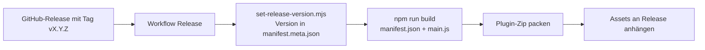

# Release-Prozess

Wie aus dem `master`-Stand ein installierbarer Release entsteht. Versionsquelle, Automatisierung und manuelle Schritte. Release-Inhalte pro Version: [notes.md](notes.md).

---

## Grundprinzip

Der Git-Tag des Releases ist die massgebende Versionsquelle. Das Skript [`scripts/set-release-version.mjs`](../../scripts/set-release-version.mjs) schreibt diese Version in `manifest.meta.json` (Single Source of Truth), der Build erzeugt daraus `manifest.json` und `main.js`. So stimmt die Manifest-Version immer mit dem Release-Tag überein.

---

## Versionsquelle

[`scripts/set-release-version.mjs`](../../scripts/set-release-version.mjs) (`npm run set-version`) bestimmt die Version in dieser Reihenfolge:

1. Argument auf der Kommandozeile
2. Umgebungsvariable `RELEASE_VERSION`
3. Umgebungsvariable `GITHUB_REF_NAME` (Git-Tag im Workflow)

Ein führendes `v` wird entfernt (`v1.2.3` wird zu `1.2.3`). Akzeptiert wird Semver (`MAJOR.MINOR.PATCH`, optionaler Prerelease-Zusatz). Ungültige Werte brechen den Lauf ab.

---

## Automatischer Ablauf

Workflow [`/.github/workflows/release.yml`](../../.github/workflows/release.yml), ausgelöst durch ein veröffentlichtes GitHub-Release (oder manuell über `workflow_dispatch` mit Versionseingabe):

1. Version aus Release-Tag oder manueller Eingabe auflösen.
2. `npm ci` für reproduzierbare Abhängigkeiten.
3. `node scripts/set-release-version.mjs` schreibt die Version in `manifest.meta.json`.
4. `npm run build` erzeugt `manifest.json` und `main.js`.
5. Plugin-Zip `ffhs-gkisw-obsidian-plugin-<version>.zip` mit `manifest.json`, `main.js` und (falls vorhanden) `main.js.map` packen.
6. Zip als Build-Artefakt ablegen; bei einem Release zusätzlich `zip`, `manifest.json` und `main.js` an den Release anhängen.

---

## Release auslösen

1. Sicherstellen, dass `master` grün ist (CI: Format, Lint, Typecheck, Test, Build).
2. Release-Notizen für die neue Version in [notes.md](notes.md) ergänzen.
3. In GitHub ein Release mit Tag `vX.Y.Z` erstellen und veröffentlichen.
4. Der Workflow läuft automatisch und hängt die Artefakte an den Release.

Der Tag muss Semver folgen; das Skript leitet die Manifest-Version daraus ab. Eine manuelle Anpassung der Version in `manifest.meta.json` ist für einen Release nicht nötig.

---

## Manuelle Installation aus dem Zip

1. Zip vom Release herunterladen und entpacken.
2. Den Ordner `ffhs-gkisw-obsidian-plugin` nach `<Vault>/.obsidian/plugins/` kopieren.
3. Obsidian neu laden und das Plugin unter **Community plugins** aktivieren.

Voraussetzungen und Erstkonfiguration: [docs/benutzer.md](../benutzer.md).
