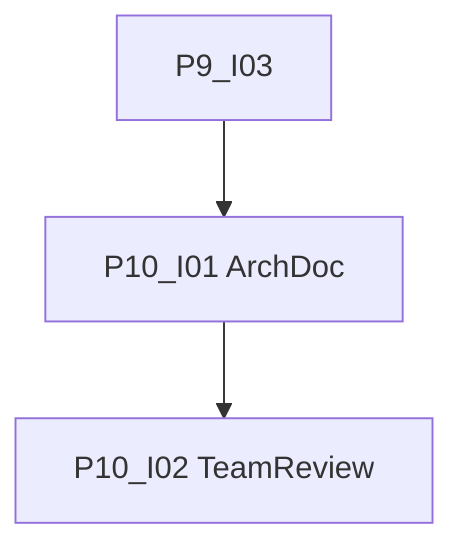

# Phase 10: Dokumentation

[Zurück zur Roadmap-Übersicht](../overview.md)

**Status:** Abgeschlossen

Systemarchitektur und Implementation dokumentieren; [SPEC.md](../../../SPEC.md) bleibt Produktspezifikation.

Voraussetzung: [Phase 9](../phase-9/README.md) **Definition of Done** (P9-I03).

## Einordnung

Phase 10 erfasst den **Ist-Stand** nach Review für zukünftige Agenten und Teammitglieder. P5-I07 und P4-I07 lieferten Entwickler-Onboarding; hier folgt die vollständige MVP-Architektur.

## Definition of Done (Phase 10)

- [x] `docs/architecture.md` mit Datenfluss, Modulen, Index-Policy, Summary-Lauf (P10-I01).
- [x] `src/README.md` und Root-README konsistent mit Ist-Stand (P10-I01).
- [x] Team-Review durchgeführt; Nacharbeit eingearbeitet (P10-I02).

## Abhängigkeitsgraph

Empfohlene Reihenfolge: **I01 → I02**.

## Arbeitspakete

| ID | GitHub | Titel | Kanonische Markdown-Datei |
|----|--------|-------|---------------------------|
| P10-I01 | #69 | [P10-I01] Architektur- und Implementationsbeschreibung | [P10-I01-architektur-dokumentation.md](./issues/P10-I01-architektur-dokumentation.md) |
| P10-I02 | #70 | [P10-I02] Team-Review und Nacharbeit | [P10-I02-team-review-doku.md](./issues/P10-I02-team-review-doku.md) |

Label auf GitHub: **Phase 10**. [Zusammenarbeit](../../zusammenarbeit/README.md).

## Verweise

- [Phase 9](../phase-9/README.md)
- [Phase 11](../phase-11/README.md)
- [SPEC.md](../../../SPEC.md)
