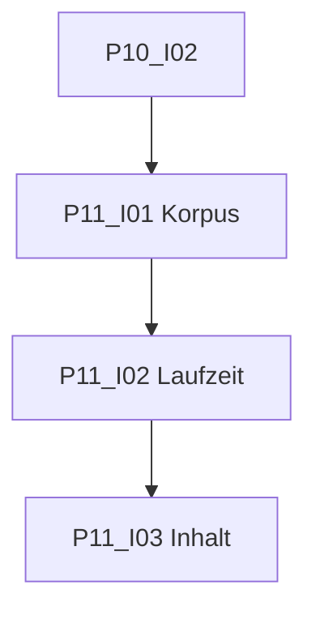

# Phase 11: Testen

[Zurück zur Roadmap-Übersicht](../README.md)

**Status:** Abgeschlossen

Evaluation gemäss [SPEC.md](../../../SPEC.md) §8: Generierungszeit, Inhaltsabdeckung, Markdown-Format.

Voraussetzung: [Phase 10](../phase-10/README.md) **Definition of Done** (P10-I02). CI-Basis: [Phase 4](../phase-4/README.md).

## Einordnung

Phase 11 liefert **nachweisbare** Evaluationsergebnisse für die Seminararbeit und Freigabe. Unit-Tests (P4-I09) decken Code ab; hier geht es um MVP-Metriken am laufenden Plugin.

## Definition of Done (Phase 11)

- [x] Evaluationskorpus: drei lange MD mit eingebauten Fehlern (P11-I01).
- [x] Generierungszeit dokumentiert; Ziel &lt; 80 s auf Referenzrechner oder begründete Abweichung (P11-I02).
- [x] Semi-auto Markdown-Check + manuelle Inhalts-Checkliste (P11-I03).
- [x] Ergebnisse unter `docs/evaluation/results/`.

## Abhängigkeitsgraph

Empfohlene Reihenfolge: **I01 → I02 → I03**.

## Arbeitspakete

| ID | GitHub | Titel | Kanonische Markdown-Datei |
|----|--------|-------|---------------------------|
| P11-I01 | #71 | [P11-I01] Evaluationskorpus anlegen | [P11-I01-evaluationskorpus.md](./issues/P11-I01-evaluationskorpus.md) |
| P11-I02 | #72 | [P11-I02] Laufzeit-Messung dokumentieren | [P11-I02-laufzeit-messung.md](./issues/P11-I02-laufzeit-messung.md) |
| P11-I03 | #73 | [P11-I03] Markdown-Checks und Inhalts-Checkliste | [P11-I03-markdown-inhalt-evaluation.md](./issues/P11-I03-markdown-inhalt-evaluation.md) |

Label auf GitHub: **Phase 11**. [Zusammenarbeit](../../zusammenarbeit/README.md).

## Verweise

- [Phase 10](../phase-10/README.md)
- [Phase 12](../phase-12/README.md)
- [SPEC.md](../../../SPEC.md) §8
