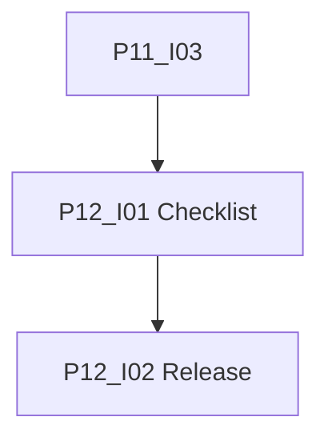

# Phase 12: Freigabe

[Zurück zur Roadmap-Übersicht](../README.md)

**Status:** Abgeschlossen

MVP-Freigabe nach dokumentierten Nachweisen aus Phase 11 und abgeschlossener Checkliste.

Voraussetzung: [Phase 11](../phase-11/README.md) **Definition of Done** (P11-I03). Prozess: [Zusammenarbeit](../../zusammenarbeit/README.md).

## Einordnung

Phase 12 schliesst die Roadmap (Schritt 12). Keine neue Entwicklung; formaler Abschluss und Versionsmarkierung.

## Definition of Done (Phase 12)

- [x] Freigabe-Checkliste gegen Phase-9–11-Nachweise abgehakt; Team-Go dokumentiert (P12-I01).
- [x] `manifest.json`-Version und Release-Notizen im Repo (P12-I02).
- [x] Roadmap Schritt 12 im Team als erledigt geführt.

## Abhängigkeitsgraph

Empfohlene Reihenfolge: **I01 → I02**.

## Arbeitspakete

| ID | GitHub | Titel | Kanonische Markdown-Datei |
|----|--------|-------|---------------------------|
| P12-I01 | #74 | [P12-I01] Freigabe-Checkliste und Testnachweise | [P12-I01-freigabe-checkliste.md](./issues/P12-I01-freigabe-checkliste.md) |
| P12-I02 | #75 | [P12-I02] Version, Manifest und Release-Notizen | [P12-I02-version-release-notizen.md](./issues/P12-I02-version-release-notizen.md) |

Label auf GitHub: **Phase 12**. [Zusammenarbeit](../../zusammenarbeit/README.md).

## Verweise

- [Phase 11](../phase-11/README.md)
- [SPEC.md](../../../SPEC.md)
- [Zusammenarbeit](../../zusammenarbeit/README.md)
