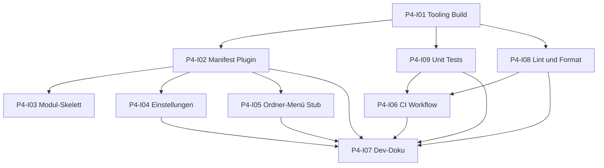

# Phase 4: Vorbereitung — Boilerplate, CI und Qualität

[Zurück zur Roadmap-Übersicht](../overview.md)

**Status:** Geplant

## Einordnung

In der [Roadmap-Übersicht](../overview.md) heisst die Kachel Phase **4** weiterhin «Erweiterte Funktionen (RAG & Vektor-DB)» als **Produktvision**. **Dieses README und die Issues P4-I01 bis P4-I09** beschreiben ausschliesslich die **technische Basis**: Tooling, lauffähige Plugin-Shell, Tests, Lint, Format, GitHub Actions, initiales Root-`README.md`. Es gibt darin **keine** RAG-, **keine** Embedding-Pipeline und **keine** Vektor-DB-Umsetzung und auch **keine** Detailplanung dazu. Architekturhinweise für spätere Schritte bleiben in [SPEC.md](../../../SPEC.md) (Abschnitte 4, 4.2, 9), bis das Team sie einer Umsetzungsphase zuordnet.

Die folgenden Arbeitspakete umfassen **Tooling, Plugin-Shell, Tests, Lint, Format, GitHub Actions** und das **initiale Root-`README.md`**, damit das Repository baubar, testbar und konsistent bleibt.

**Reihenfolge README (Boilerplate):** Das initiale `README.md` wird nach dem finalen CI-Workflow ([P4-I06](./issues/P4-I06-ci-workflow.md)) inhaltlich fertiggestellt ([P4-I07](./issues/P4-I07-entwicklerdokumentation.md)).

## Definition of Done (Boilerplate-Paket)

- [ ] `npm ci` und `npm run build` dokumentiert und auf CI grün.
- [ ] `npm test` mit Unit-Tests; lokal und auf CI grün.
- [ ] Lint und Format als Quality Gates in GitHub Actions.
- [ ] Plugin in Obsidian ladbar; Einstellungen mit SPEC-Defaults; Ordner-Kontextmenü **Create Summary** (Stub) mit Notice.
- [ ] `src/`-Struktur für spätere Module; initiales Root-`README.md` nach finalem Workflow.

## Abhängigkeitsgraph (Boilerplate-Issues)

Konkrete **Blockiert-von**-Angaben stehen in den jeweiligen Dateien unter [`issues/`](./issues/).

## Arbeitspakete

| ID | GitHub-Issue-Titel | Kanonische Markdown-Datei |
|----|--------------------------|---------|
| P4-I01 | [P4-I01] Build-Pipeline Node 20, TypeScript, esbuild | [P4-I01-tooling-build-pipeline.md](./issues/P4-I01-tooling-build-pipeline.md) |
| P4-I02 | [P4-I02] Obsidian-Manifest und Plugin-Lebenszyklus | [P4-I02-manifest-plugin-lebenszyklus.md](./issues/P4-I02-manifest-plugin-lebenszyklus.md) |
| P4-I03 | [P4-I03] Modul-Skelett unter `src/` | [P4-I03-modul-skelett-src.md](./issues/P4-I03-modul-skelett-src.md) |
| P4-I04 | [P4-I04] Einstellungen und Persistenz (SPEC-Defaults) | [P4-I04-einstellungen-persistenz.md](./issues/P4-I04-einstellungen-persistenz.md) |
| P4-I05 | [P4-I05] Ordner-Kontextmenü «Create Summary» (Stub) | [P4-I05-ordner-kontextmenue-stub.md](./issues/P4-I05-ordner-kontextmenue-stub.md) |
| P4-I06 | [P4-I06] GitHub Actions: Build, Tests und Quality Gates | [P4-I06-ci-workflow.md](./issues/P4-I06-ci-workflow.md) |
| P4-I07 | [P4-I07] Initiales README, Entwicklerdokumentation und Onboarding | [P4-I07-entwicklerdokumentation.md](./issues/P4-I07-entwicklerdokumentation.md) |
| P4-I08 | [P4-I08] Linting, Formatierung und Skripte für Quality Gates | [P4-I08-lint-format-quality-gates.md](./issues/P4-I08-lint-format-quality-gates.md) |
| P4-I09 | [P4-I09] Unit-Test-Infrastruktur und erstes Beispiel | [P4-I09-unit-tests-infrastruktur.md](./issues/P4-I09-unit-tests-infrastruktur.md) |

GitHub-Issues und Repo-Markdown: [Zusammenarbeit](../../zusammenarbeit/README.md).

## Verweise

- [SPEC.md](../../../SPEC.md)
- [Roadmap-Übersicht](../overview.md)
- [Phase 3 README](../phase-3/README.md)
- [Zusammenarbeit](../../zusammenarbeit/README.md)
- [docs/agents-docs/](../../agents-docs/README.md)
