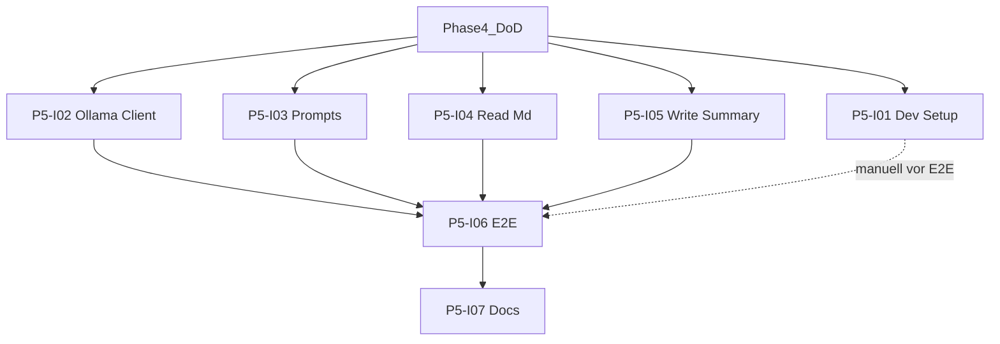

# Phase 5: Kommunikation mit dem LLM

[Zurück zur Roadmap-Übersicht](../overview.md)

**Status:** Geplant

End-to-End **Create Summary** ohne RAG: alle Quell-`.md` unter dem Ordner als ein Korpus → Ollama `/api/chat` → Summary-Datei im Vault (erst `{Ordnername}_summary.md`, danach `_summary_2`, … ohne Überschreiben der Basisdatei).

Voraussetzung: [Phase 4](../phase-4/README.md) (Boilerplate). Architektur: [SPEC.md](../../../SPEC.md) §5, §7, §11 Schritt 2. RAG ab [Phase 6](../phase-6/README.md).

## Einordnung

Phase 5 ersetzt den Menü-Stub (P4-I05) durch einen echten Lauf, nutzt aber noch **keinen** **Vektorindex**. Überschreitung des **Kontextlimits** oder leerer **Quellordner** → Abbruch mit Notice (kein Kürzen). Ab [Phase 7](../phase-7/README.md) liefert Retrieval den Kontext.

## Definition of Done (Phase 5)

- [ ] README: Ollama-Installation und SPEC-Modell-Tags dokumentiert (P5-I01).
- [ ] `src/ollama/`: Healthcheck + `/api/chat`; Tests mit gemocktem `fetch` (P5-I02).
- [ ] Prompt-Modul: Messages für Summary; SPEC §7-Ziele in Tests/Struktur (P5-I03).
- [ ] Ordner-`.md` einlesen; Quellenfilter; leerer Ordner als Fehlerfall (P5-I04).
- [ ] Summary schreiben (Basisdatei, dann Versionen ohne Überschreiben); Erfolgs-Notice mit Dateiname (P5-I05).
- [ ] Einstellungen: **Kontextlimit**, **Ollama-Timeout** (Defaults 32'000 Zeichen, 90 s) (P5-I06).
- [ ] Menü **Create Summary** End-to-End; ein **Summary-Lauf** zur Zeit (P5-I06).
- [ ] `npm test`, `npm run build`, CI grün; `src/README.md` aktualisiert (P5-I07).

## Abhängigkeitsgraph

Konkrete **Blockiert-von**-Angaben in den jeweiligen [`issues/`](./issues/)-Dateien.

## Arbeitspakete

| ID | GitHub | Titel | Kanonische Markdown-Datei |
|----|--------|-------|---------------------------|
| P5-I01 | #19 | [P5-I01] Ollama-Entwickler-Setup und Modelle | [P5-I01-ollama-entwickler-setup.md](./issues/P5-I01-ollama-entwickler-setup.md) |
| P5-I02 | #20 | [P5-I02] Ollama-HTTP-Client (Healthcheck und Chat) | [P5-I02-ollama-http-client.md](./issues/P5-I02-ollama-http-client.md) |
| P5-I03 | #21 | [P5-I03] System-Prompt-Modul | [P5-I03-system-prompt-modul.md](./issues/P5-I03-system-prompt-modul.md) |
| P5-I04 | #22 | [P5-I04] Markdown aus Ordner einlesen | [P5-I04-ordner-markdown-einlesen.md](./issues/P5-I04-ordner-markdown-einlesen.md) |
| P5-I05 | #23 | [P5-I05] Summary-Datei ins Vault schreiben | [P5-I05-summary-datei-schreiben.md](./issues/P5-I05-summary-datei-schreiben.md) |
| P5-I06 | #24 | [P5-I06] Create Summary End-to-End ohne RAG | [P5-I06-create-summary-ohne-rag.md](./issues/P5-I06-create-summary-ohne-rag.md) |
| P5-I07 | #25 | [P5-I07] Phase-5-Dokumentation | [P5-I07-phase5-dokumentation.md](./issues/P5-I07-phase5-dokumentation.md) |

Label auf GitHub: **Phase 5** (zusätzlich **documentation** bei #19 und #25). [Zusammenarbeit](../../zusammenarbeit/README.md).

## Verweise

- [Roadmap-Übersicht](../overview.md)
- [SPEC.md](../../../SPEC.md)
- [Phase 4](../phase-4/README.md)
- [Phase 6 — Einbau RAG](../phase-6/README.md)
