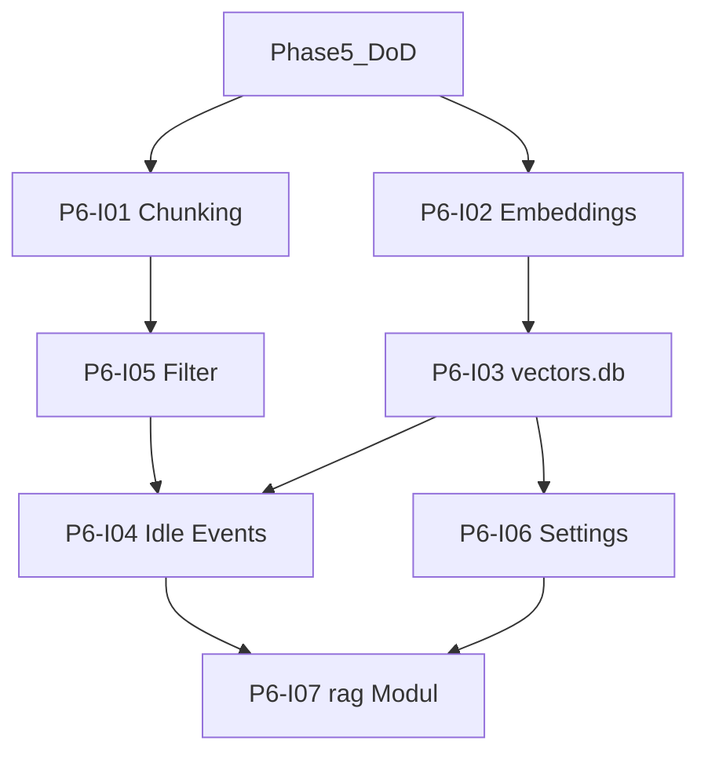

# Phase 6: Einbau RAG

[Zurück zur Roadmap-Übersicht](../overview.md)

**Status:** Geplant

**Vektorindex** (`vectors.db` im Plugin-Datenverzeichnis): absatzbasiertes Chunking, Ollama-Embeddings, SQLite/`sqlite-wasm-vec`. Index vault-weit per Idle-Job (3 Dateien pro Tick) und Vault-Events; On-Demand-Nachindex für Ordner-Scope mit Notice «Indexiere…» (Fassade in P6-I07). Retrieval in Create Summary: [Phase 7](../phase-7/README.md).

Voraussetzung: [Phase 5](../phase-5/README.md) **Definition of Done** erfüllt (letztes Arbeitspaket P5-I07). Architektur: [SPEC.md](../../../SPEC.md) §4.1, §4.3, §4.4.

## Einordnung

Phase 6 baut den lokalen **Vektorindex** und die Index-Pflege (Hybrid: Idle + Events + On-Demand). **Create Summary** bleibt bis Phase 7 auf dem Phase-5-Vollkorpus-Pfad. Implementierung startet erst nach abgeschlossener Phase 5.

## Definition of Done (Phase 6)

- [ ] Absatz-Chunking mit einstellbarer Grösse/Overlap (Defaults 1000 / 200) (P6-I01, P6-I06).
- [ ] Embeddings-Client für `embeddingModel` (P6-I02).
- [ ] `vectors.db` mit konsistentem Schema; Quellenfilter im Index (P6-I03, P6-I05).
- [ ] Idle-Hintergrund-Job (max. 3 Dateien/Tick) + Vault-Events; On-Demand `indexFolderScope` (P6-I04).
- [ ] On-Demand-Notice «Indexiere…» in öffentlicher Fassade (P6-I07).
- [ ] Einstellungen: Chunk-Felder, «Vektorindex zurücksetzen»; Embedding-Modell-Wechsel → truncate + Re-Index (P6-I06).
- [ ] `src/rag/` exportiert testbare API; `npm test` / `npm run build` / CI grün (P6-I07).

## Abhängigkeitsgraph

Konkrete **Blockiert-von**-Angaben in den jeweiligen [`issues/`](./issues/)-Dateien. Alle P6-Issues setzen Phase-5-DoD voraus (P5-I07).

Empfohlene Implementierungsreihenfolge: **I01 → I02 → I03 → I05 (parallel zu I03 möglich) → I04 → I06 → I07**.

## Arbeitspakete

| ID | GitHub | Titel | Kanonische Markdown-Datei |
|----|--------|-------|---------------------------|
| P6-I01 | — | [P6-I01] Absatz-Chunking (Pure) | [P6-I01-absatz-chunking.md](./issues/P6-I01-absatz-chunking.md) |
| P6-I02 | — | [P6-I02] Ollama-Embeddings-HTTP-Client | [P6-I02-ollama-embeddings-client.md](./issues/P6-I02-ollama-embeddings-client.md) |
| P6-I03 | — | [P6-I03] vectors.db und SQLite-Schema | [P6-I03-vectors-db-schema.md](./issues/P6-I03-vectors-db-schema.md) |
| P6-I04 | — | [P6-I04] Idle-Index und Vault-Events | [P6-I04-idle-index-vault-events.md](./issues/P6-I04-idle-index-vault-events.md) |
| P6-I05 | — | [P6-I05] Quellenfilter im Vektorindex | [P6-I05-quellenfilter-index.md](./issues/P6-I05-quellenfilter-index.md) |
| P6-I06 | — | [P6-I06] Einstellungen Vektorindex | [P6-I06-einstellungen-vektorindex.md](./issues/P6-I06-einstellungen-vektorindex.md) |
| P6-I07 | — | [P6-I07] rag-Modul und Plugin-Integration | [P6-I07-rag-modul-integration.md](./issues/P6-I07-rag-modul-integration.md) |

GitHub-Issues nach Team-Freigabe anlegen ([github-issue-anlegen](../../../.agents/skills/github-issue-anlegen/SKILL.md)); Spalte **GitHub** dann mit `#n` füllen. Label: **Phase 6**. [Zusammenarbeit](../../zusammenarbeit/README.md).

## Verweise

- [Phase 5](../phase-5/README.md)
- [Phase 7](../phase-7/README.md)
- [SPEC.md](../../../SPEC.md)
