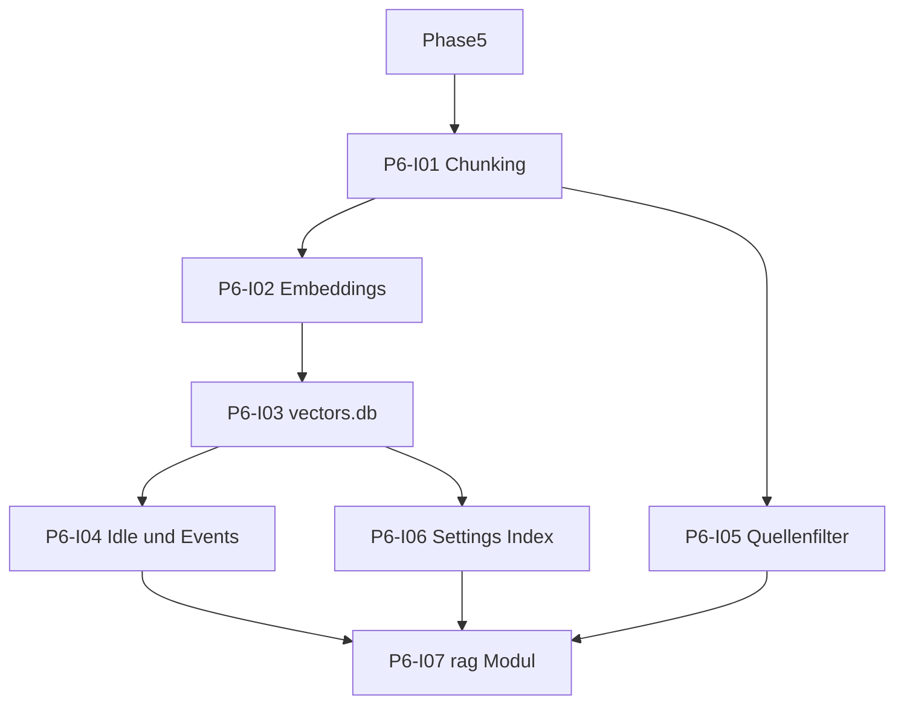

# Phase 6: Einbau RAG

[Zurück zur Roadmap-Übersicht](../overview.md)

**Status:** Entwurf

**Vektorindex** (`vectors.db` im Plugin-Datenverzeichnis): Chunking, Ollama-Embeddings, SQLite/`sqlite-wasm-vec`. Index vault-weit per Idle-Job und Events; Retrieval nur im gewählten Ordner-Scope; On-Demand-Nachindex mit Notice «Indexiere…».

Voraussetzung: [Phase 5](../phase-5/README.md). Verknüpfung mit LLM: [Phase 7](../phase-7/README.md). Architektur: [SPEC.md](../../../SPEC.md) §4.1, §4.3, §4.4.

## Definition of Done (Entwurf)

- [ ] Chunking mit einstellbarer Grösse/Overlap (Defaults 1000 / 200).
- [ ] Embeddings-Client für `embeddingModel`.
- [ ] `vectors.db` mit konsistentem Schema; Quellenfilter im Index.
- [ ] Idle-Hintergrund-Job + Vault-Events; On-Demand-Index mit Notice «Indexiere…».
- [ ] Einstellungen: «Vektorindex zurücksetzen»; Re-Index bei Embedding-Modell-Wechsel.
- [ ] `src/rag/` exportiert testbare API; `npm test` / CI grün.

## Abhängigkeitsgraph (Skelett)

## Arbeitspakete (Entwurf, noch keine `issues/*.md`)

| ID | Kurzbeschreibung |
|----|------------------|
| P6-I01 | Chunking (Pure); Grösse/Overlap aus Einstellungen |
| P6-I02 | Ollama Embeddings-HTTP-Client |
| P6-I03 | SQLite + `sqlite-wasm-vec`, Schema, `vectors.db`-Pfad |
| P6-I04 | Idle-Hintergrund-Index + Vault-Event-Handler |
| P6-I05 | Quellenfilter im Index (Summary-Dateien, `.obsidian`) |
| P6-I06 | Settings: Chunk-Felder, Index zurücksetzen, Embedding-Wechsel → Re-Index |
| P6-I07 | `src/rag/` API, Tests, README |

Vollständige Issue-Specs nach Team-Freigabe des Entwurfs.

## Verweise

- [Phase 5](../phase-5/README.md)
- [Phase 7](../phase-7/README.md)
- [SPEC.md](../../../SPEC.md)
