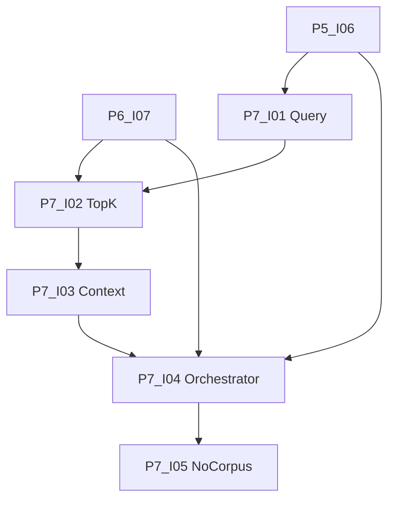

# Phase 7: Verknüpfung RAG mit LLM

[Zurück zur Roadmap-Übersicht](../overview.md)

**Status:** Geplant

**Create Summary** nutzt Retrieval: On-Demand-Index → Query-Embedding aus Mini-Korpus (roher Concat, Cap 8'000) → semantisches Top-K im **Ordner**-Scope → **Retrieval-Kontext** im Chat. Kein Volltext-**Ordner-Quellkorpus** mehr (P7-I05).

Voraussetzungen: [Phase 5](../phase-5/README.md) (P5-I06 E2E), [Phase 6](../phase-6/README.md) **Definition of Done** (P6-I07 inkl. `searchSimilarInFolder`). Architektur: [SPEC.md](../../../SPEC.md) §4.2.

## Einordnung

Phase 7 verkabelt RAG und LLM. Phase 6 liefert **Vektorindex** und On-Demand; Phase 5 liefert Menü, Prompts und Summary-Schreiben. Implementierung startet erst nach Phase-6-DoD.

## Definition of Done (Phase 7)

- [ ] Retrieval-Query-Text und semantisches Top-K (P7-I01, P7-I02).
- [ ] **Retrieval-Kontext** + `retrievalTopK` in Einstellungen (Default 8) (P7-I03).
- [ ] Summary-Orchestrator RAG mit Kontextlimit auf Chunks, zwei Leer-Notices (P7-I04).
- [ ] Vollkorpus-Pfad aus Produktion entfernt (P7-I05).
- [ ] `npm test`, `npm run build`, CI grün; manueller Test mit indexiertem Ordner (P7-I04).

## Abhängigkeitsgraph

Konkrete **Blockiert-von**-Angaben in den jeweiligen [`issues/`](./issues/)-Dateien.

Empfohlene Reihenfolge: **I01 → I02 → I03 → I04 → I05**.

## Arbeitspakete

| ID | GitHub | Titel | Kanonische Markdown-Datei |
|----|--------|-------|---------------------------|
| P7-I01 | #43 | [P7-I01] Retrieval-Query-Text (Pure) | [P7-I01-retrieval-query-text.md](./issues/P7-I01-retrieval-query-text.md) |
| P7-I02 | #44 | [P7-I02] Retrieve Top-K (semantisch) | [P7-I02-retrieve-top-k.md](./issues/P7-I02-retrieve-top-k.md) |
| P7-I03 | #45 | [P7-I03] Retrieval-Kontext und Top-K-Einstellung | [P7-I03-retrieval-kontext-top-k-settings.md](./issues/P7-I03-retrieval-kontext-top-k-settings.md) |
| P7-I04 | #46 | [P7-I04] Summary-Orchestrator (RAG-Pfad) | [P7-I04-summary-orchestrator-rag.md](./issues/P7-I04-summary-orchestrator-rag.md) |
| P7-I05 | #47 | [P7-I05] Vollkorpus-Pfad aus Produktionsflow entfernen | [P7-I05-vollkorpus-entfernen.md](./issues/P7-I05-vollkorpus-entfernen.md) |

Label auf GitHub: **Phase 7**. [Zusammenarbeit](../../zusammenarbeit/README.md).

## Verweise

- [Phase 6](../phase-6/README.md)
- [Phase 8](../phase-8/README.md)
- [SPEC.md](../../../SPEC.md)
