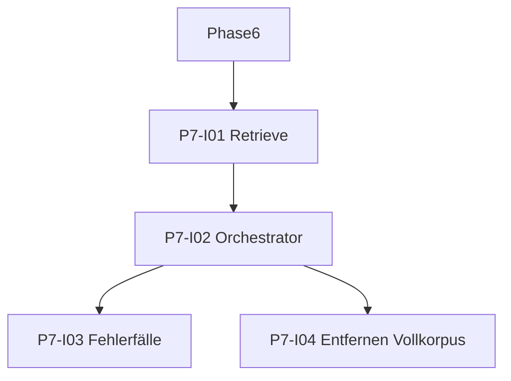

# Phase 7: Verknüpfung RAG mit LLM

[Zurück zur Roadmap-Übersicht](../overview.md)

**Status:** Entwurf

Retrieval-Chunks aus dem Vektorindex (nur Ordner-Scope) ersetzen den Volltext-Korpus aus Phase 5. Nach On-Demand-Index: bei 0 Treffern Abbruch mit Notice, kein Volltext-Fallback.

Voraussetzungen: [Phase 5](../phase-5/README.md), [Phase 6](../phase-6/README.md). Architektur: [SPEC.md](../../../SPEC.md) §4.2.

## Definition of Done (Entwurf)

- [ ] Retrieve Top-K (einstellbar, Default 8) im Ordner-Scope.
- [ ] **Kontextlimit** auf Summe der Chunk-Texte; Überschreitung → Abbruch.
- [ ] Orchestrator nutzt nur Retrieval-Kontext (P5-Vollkorpus-Pfad entfernt).
- [ ] On-Demand-Index + **Leeres Retrieval** gemäss CONTEXT.
- [ ] Manueller E2E-Test mit indexiertem Ordner; `npm test` grün.

## Abhängigkeitsgraph (Skelett)

## Arbeitspakete (Entwurf)

| ID | Kurzbeschreibung |
|----|------------------|
| P7-I01 | Retrieve Top-K API (Ordner-Scope; K aus Einstellungen) |
| P7-I02 | Orchestrator: Chunks → `buildSummaryMessages` → Chat |
| P7-I03 | On-Demand-Index, 0 Treffer, Kontextlimit auf Chunks |
| P7-I04 | P5-Vollkorpus-Pfad aus Produktionsflow entfernen |

## Verweise

- [Phase 6](../phase-6/README.md)
- [Phase 8](../phase-8/README.md)
- [SPEC.md](../../../SPEC.md)
