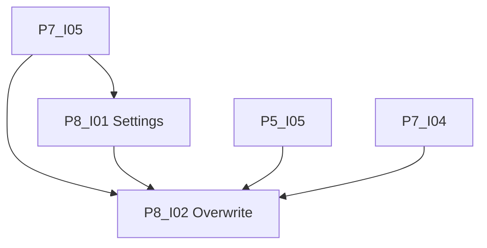

# Phase 8: Finalisierung

[Zurück zur Roadmap-Übersicht](../overview.md)

**Status:** Geplant

Feinschliff der Plugin-Einstellungen und UX; Felder aus P4–P7 werden gruppiert, mit Hilfetexten und Validierung versehen. Ollama-Prüfung umfasst Generierungs- und Embedding-Modell (Orchestrator und Verbindungstest-Button). Optional: **Summary-Überschreiben** der **Summary-Basisdatei**.

Voraussetzung: [Phase 7](../phase-7/README.md) **Definition of Done** (P7-I05). Architektur: [SPEC.md](../../../SPEC.md) §6, US-03.

## Einordnung

Phase 8 schliesst die MVP-Einstellungen ab. Phase 7 liefert RAG-Orchestrierung; P6/P7 liefern Chunk- und Retrieval-Felder funktional — Phase 8 poliert UX und ergänzt **Summary-Überschreiben**.

## Definition of Done (Phase 8)

- [ ] Settings-UX: drei Abschnitte (Ollama, Vektorindex, Zusammenfassung), Hilfetexte, positive Ganzzahl-Validierung; Kontextlimit = **Retrieval-Kontext** (P8-I01).
- [ ] Generierungsmodell: Freitext mit Empfehlung `gemma4:e2b` / `gemma4:e4b` im Hilfetext (P8-I01).
- [ ] Ollama Dual-Check (Gen + Embed) im Orchestrator und per Button «Verbindung testen» (P8-I01).
- [ ] **Summary-Überschreiben**: Toggle, Default aus; nur **Summary-Basisdatei**; Notice «Summary überschrieben: …» (P8-I02).
- [ ] Manueller Klicktest in PR-Beschreibung P8-I02 dokumentiert.
- [ ] `npm test`, `npm run build`, CI grün.

## Abhängigkeitsgraph

Konkrete **Blockiert-von**-Angaben in den jeweiligen [`issues/`](./issues/)-Dateien.

Empfohlene Reihenfolge: **I01 → I02**.

## Arbeitspakete

| ID | GitHub | Titel | Kanonische Markdown-Datei |
|----|--------|-------|---------------------------|
| P8-I01 | #64 | [P8-I01] Settings-UX und Validierung | [P8-I01-settings-ux-validierung.md](./issues/P8-I01-settings-ux-validierung.md) |
| P8-I02 | #65 | [P8-I02] Summary-Überschreiben | [P8-I02-summary-ueberschreiben.md](./issues/P8-I02-summary-ueberschreiben.md) |

Label auf GitHub: **Phase 8**. [Zusammenarbeit](../../zusammenarbeit/README.md).

## Verweise

- [Phase 7](../phase-7/README.md)
- [Phase 9](../phase-9/README.md)
- [SPEC.md](../../../SPEC.md)
