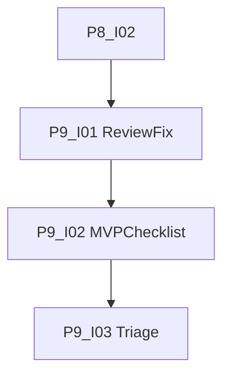

# Phase 9: Review

[Zurück zur Roadmap-Übersicht](../overview.md)

**Status:** Geplant

Automatisches Review (Skill review-and-fix) und manuelle MVP-Klicktests vor Dokumentation und Evaluation. Kritische Findings werden behoben oder als Follow-up erfasst.

Voraussetzung: [Phase 8](../phase-8/README.md) **Definition of Done** (P8-I02). Skill: [review-and-fix](../../../.agents/skills/review-and-fix/SKILL.md).

## Einordnung

Phase 9 stabilisiert den MVP-Code und das Verhalten in Obsidian. Keine neue Funktionalität; Qualitätssicherung vor Architektur-Doku (Phase 10) und Evaluationsläufen (Phase 11).

## Definition of Done (Phase 9)

- [x] Review-and-fix-Lauf auf `src/`; Findings dokumentiert (P9-I01).
- [x] Manuelle MVP-Checkliste abgearbeitet und in PR dokumentiert (P9-I02).
- [x] Offene Findings behoben oder als Follow-up-Issues erfasst (P9-I03).
- [x] `npm run lint`, `npm run typecheck`, `npm test`, `npm run build` grün.

## Abhängigkeitsgraph

Empfohlene Reihenfolge: **I01 → I02 → I03**.

## Arbeitspakete

| ID | GitHub | Titel | Kanonische Markdown-Datei |
|----|--------|-------|---------------------------|
| P9-I01 | #66 | [P9-I01] Automatisches Review (review-and-fix) | [P9-I01-review-and-fix.md](./issues/P9-I01-review-and-fix.md) |
| P9-I02 | #67 | [P9-I02] Manuelle MVP-Klick-Checkliste | [P9-I02-manuelle-mvp-checkliste.md](./issues/P9-I02-manuelle-mvp-checkliste.md) |
| P9-I03 | #68 | [P9-I03] Findings: Fix-PRs oder Follow-up-Issues | [P9-I03-findings-triage.md](./issues/P9-I03-findings-triage.md) |

Label auf GitHub: **Phase 9**. [Zusammenarbeit](../../zusammenarbeit/README.md).

## Verweise

- [Phase 8](../phase-8/README.md)
- [Phase 10](../phase-10/README.md)
- [SPEC.md](../../../SPEC.md)
